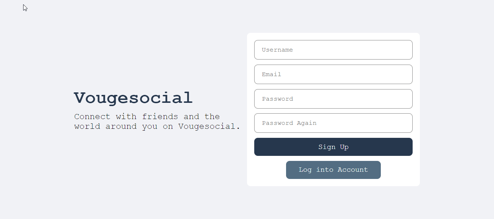
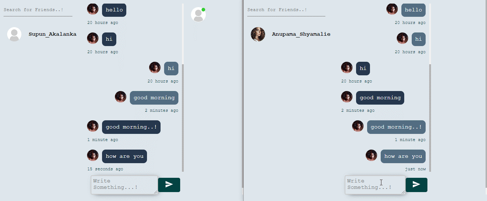

# Social Media Application

This project is a full-stack social media application built using the MERN stack. It includes features such as user authentication, context API for state management, socket.io for real-time chat, feed posts, and private messaging.

## Screenshots

| Screenshot | Description |
|------------|-------------|
|  | **Register Page**: User registration page with form validation. |
|  | **Login Page**: User login page with authentication. |
|  | **Feed Page**: Main feed where users can share and view posts. |
|  | **Chat Interface**: Real-time private messaging with socket.io. |

## Features

- **Authentication**: User login and registration.
- **Context API**: State management for user data and application state.
- **Socket.io**: Real-time chat functionality for private messaging.
- **Feed Posts**: Users can create, view, and interact with posts.
- **Private Chat**: Real-time private messaging between users.

## Technologies Used

- **Frontend**: 
  -  React
  -  JavaScript
  -  CSS
  -  Socket.io-client
- **Backend**: 
  -  Node.js
  -  MongoDB
  -  Express.js

- **Authentication**: JSON Web Tokens (JWT).
- **Styling**: CSS (or use of libraries like Bootstrap or Material UI).

## Prerequisites

Before running the application, make sure you have the following installed:

- Node.js and npm (or yarn)
- MongoDB (running locally or a connection to a MongoDB instance)

## Getting Started

### Installation
